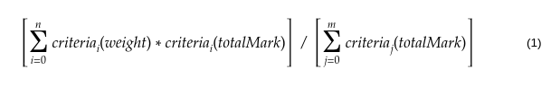

# chain-stats

Stress Testing and Analytics Blockchain Tool

## Motivation

There is currently no infrastructure that allows Solidity developers to test their smart contracts in a production-like environment. This often leads to publishing code that would not perform optimally when put under stress. This project solves this problem by allowing developers to mimic stress scenarios and receive insights and analytics that can be used to improve the quality of smart contract development.

This project was built during the [EthSanFrancisco Hackathon](https://ethsanfrancisco.com/).

### Members:

- [Arjit Khullar](https://github.com/arjitkhullar)
- [Drew Patel](https://github.com/dewpey)
- [Tomisin Jenrola](https://github.com/ToJen)

## Requirements

- [Node.js](https://nodejs.org/en/download/)
- Yarn (optional): `npm i -g yarn`
- [ganache-cli](https://truffleframework.com/ganache): `npm i -g ganache-cli`

## Setup

- Clone this repo: `git clone https://github.com/ToJen/chain-stats.git`
- Start a local test Ethereum node with ganache: `ganache-cli`
- Go into the repo: `cd chain-stats`
- Start the backend in a new terminal window:
  - `cd backend`
  - `yarn && yarn start:dev` or `npm i && npm run start:dev`
- Launch the frontend in a new terminal window:
  - `cd frontend`
  - `yarn && yarn start` or `npm i && npm run start`

---

### Benchmark Score

The benchmark score is a representation of the total performance of a smart contract. It has the following criteria:

- Speed
- Guards
- Modularity
- Upgradability
- Cost Efficiency

